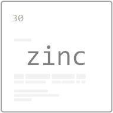

<h1 align='center'>Zinc</h1>

<p align='center'>A command-line tool for (internal) memos :pencil2:</p>

<br />

<br />

<p align="center">
  
</p>

<br />

<br />

A command-line tool to sink and find memos (a.k.a notes) on the fly from your favourite terminal. `Zinc` follows a [simplified markdown template](examples/memo.md) to store the memos.

<br />


<br />

## Contents

- [Contents](#contents)
- [Install & Run](#install--run)
  - [Dev Environment](#dev-environment)
- [How it works](#how-it-works)
- [Commands & Usages](#commands--usages)
  - [`--sink` memos](#--sink-memos)
  - [`--write` memos](#--write-memos)
  - [`--zync` memos](#--zync-memos)
  - [`--find` memos](#--find-memos)
  - [`--update` memo](#--update-memo)
  - [`--remove` memo](#--remove-memo)
  - [`--list` memos](#--list-memos)
- [License](#license)

<br />

## Install & Run

### Dev Environment

Clone the tool from [here](https://github.com/athiththan11/Zinc) and execute the following command from the root directory to install the dependencies

```sh
npm install
```

Execute the following command from the root directory to link the `Zinc` with the local Node modules

```sh
npm link
```

To verify, fire up a terminal and execute the following

```sh
zinc --version
```

## How it works

`Zinc` uses a simplified markdown structure to write and sink the memos (notes). Once `Zinc` is installed in your environment to store notes,

- Execute the [`--sink`](#--sink-memos) command to configure the `Zinc` with a preferred location to physically store the memos and the meta information
- Then execute the [`--write`](#--write-memos) command to create your first memo / note
- Execute the [`--zync`](#--zync-memos) command to sync the memos and to generate a meta JSON
- Find and retrieve back your memos with [`--find`](#--find-memos) flag and the keyword

## Commands & Usages

```sh
Usage: zinc [flag]

Options:
  --version     Show version number                                    [boolean]
  -s, --sink    configure a location to sink the memos                 [boolean]
  -w, --write   write a memo                                           [boolean]
  -z, --zync    zi(sy)nc the memos                                     [boolean]
  -f, --find    keyword to search through                               [string]
  -u, --update  update/rewrite an existing memo                         [string]
  -r, --remove  remove a memo                                           [string]
  -l, --list    list all memos                                         [boolean]
  --help        Show help                                              [boolean]

Examples:
  zinc --sink              configure a sink location to store the memos
  zinc --write             write a memo by providing a title, description,
                           source (an external (URL) reference), and
                           code/segment if exists
  zinc --zync              sync the memos to find the memos using the keyword
  zinc --find <keyword>    find a memo using the keyword
  zinc --update <keyword>  update/rewrite an existing memo
  zinc --remove <keyword>  remove a memo from zinc
  zinc --list              list all memos
```

### `--sink` memos

The `--sink` flag is used to setup the `Zinc` in your environment and to configure a sink (storage) location to persist the memos. Execute the following command to configure the `sink` location for `Zinc`

```sh
zinc --sink
```

### `--write` memos

The `--write` flag is used to write memos from the terminal window. `Zinc` prompts a couple of required questions to fill up and then voila, your memo (note) is stored inside the configured `sink` location.

```sh
zinc --write
```

### `--zync` memos

The `--zync` flag is used to sync the memos which are stored in the `sink`. `Zinc` syncs the memos (notes) and creates a meta JSON to use it onwards.

```sh
zinc --zync
```

### `--find` memos

The `--find` flag is used to search through the memos using the prompted keywords. `Zinc` uses the meta JSON to traverse through and find the matching memos with the given keyword.

```sh
zinc --find <keyword>
```

### `--update` memo

The `--update` flag is used to search and update/re-write and existing memo in the `Zinc`.

```sh
zinc --update <keyword>
```

### `--remove` memo

The `--remove` flag is used to search and remove an existing memo from the `Zinc`.

```sh
zinc --remove <keyword>
```

### `--list` memos

The `--list` flag is used to list all existing memos of the `Zinc`.

```sh
zinc --list
```

## License

Licensed under [MIT](LICENSE)
